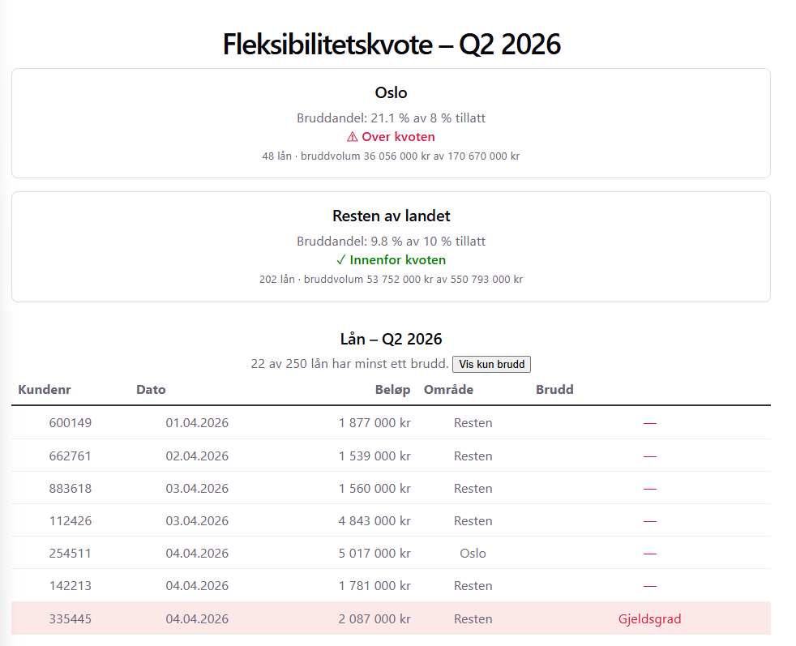

# Utlånskontroll

Overvåker utlån iht. utlånsforskriften med fake data. 
Java/Spring med layered architecture, eksponerer REST-API med lån og kvoter. React og Vite frontend.



## Endepunkter

- `GET /api/lan` – alle lån
- `GET /api/kvote` – beregnet kvotestatus per segment

## Kjøre lokalt

Backend (port 8080):

```bash
cd backend
./gradlew bootRun
```

Frontend (port 5173):

```bash
cd frontend
npm install
npm run dev
```

Frontend proxyer `/api` til backend i utvikling.
